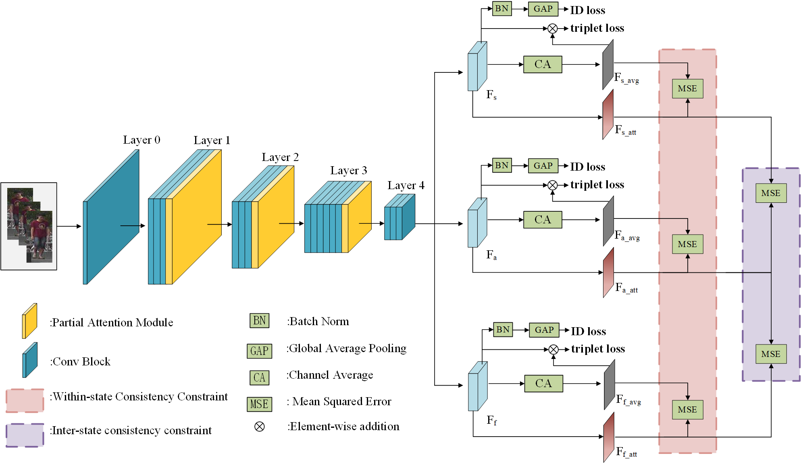
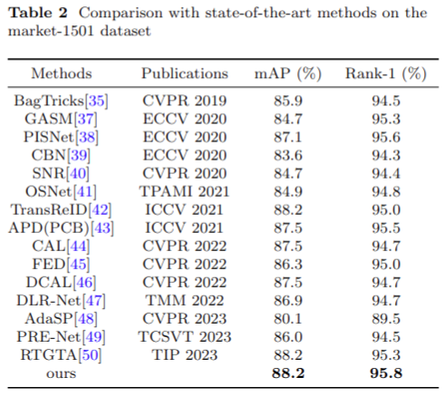
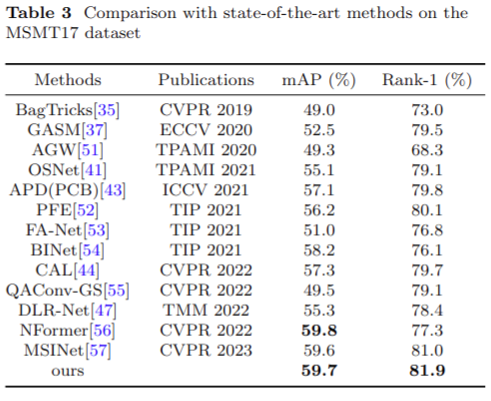
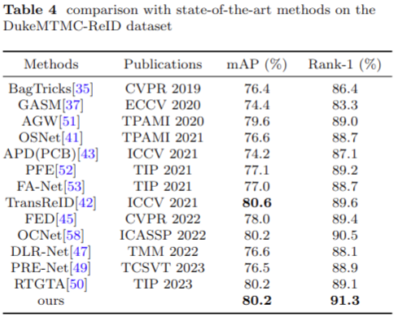
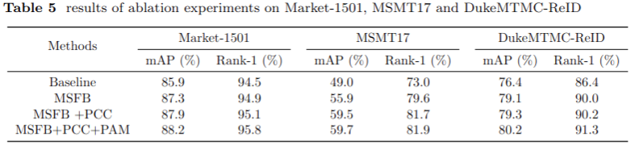

# Multi-State Perception Consistency Constraints Network for Person Re-Identification


Person re-identification (re-id) identifies a query person in multiple non overlapping camera views where the same
person appears in different poses, angles and views under different illumination conditions.

# Datasets

Remember to set your path to the root of the dataset in config/defaults.py for all training and testing or set in every single config file in configs/ or set in every single command.

（1）Market1501

* Download dataset from http://www.liangzheng.org/Project/project_reid.html
* Extract dataset and rename to `market1501`. The data structure would like:

（2）DukeMTMC-reID

* Download dataset from https://github.com/layumi/DukeMTMC-reID_evaluation#download-dataset
* Extract dataset and rename to `dukemtmc-reid`. 

（3）MSMT17

* Download dataset to from https://www.pkuvmc.com/dataset.html
* Extract dataset and rename to `msmt17`. 


# Training

（1）Prepare pretrained model if you don't have.
    
You can download the pre-trained ResNet_iBN_a model weights on ImageNet from here [[link]](https://drive.google.com/open?id=1_r4wp14hEMkABVow58Xr4mPg7gvgOMto)

（2）Train

You can use the following statements to run the training script to train different datasets with different losses. And select whether to use the perception consistency constraint by modifying the `IF_WITH_CLOSS` in the config file.

```bash
python3 tools/train_idea.py --config_file='configs/softmax_triplet.yml' MODEL.DEVICE_ID "('your device id')" DATASETS.NAMES "('market1501')" OUTPUT_DIR "('your path to save checkpoints and logs')"
```

# Proposed results

The proposed network is trained and evaluated on three different preson re-id datasets, representation of the
results is given below:

<div align=center>

</div>

<div align=center>

</div>

<div align=center>

</div>

The proposed method was also subjected to ablation experiments on three person re-identification datasets, and the results are shown in the following table:

<div align=center>

</div>
